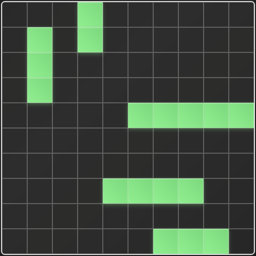
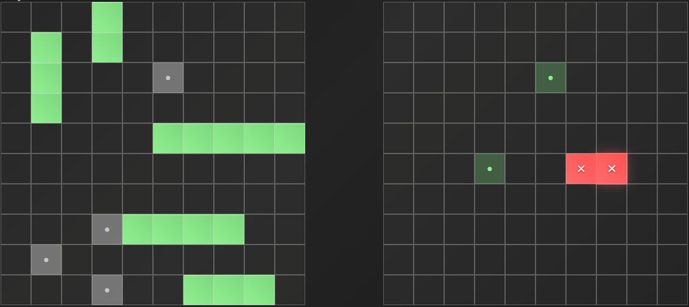
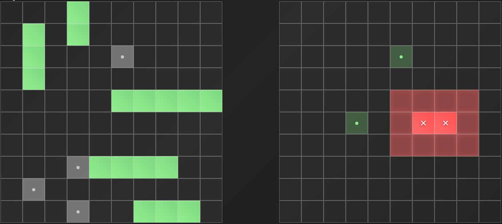
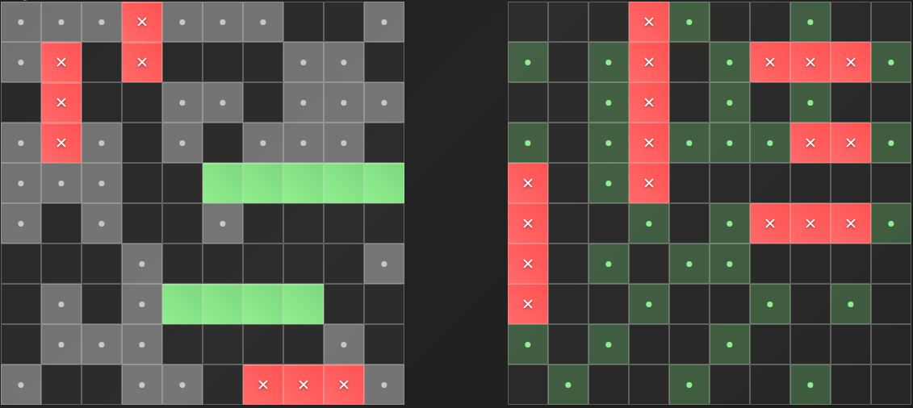

# 🚢 Battleship Game

A fully functional, animated **Battleship game** built with modern JavaScript. Supports both **1-player (vs AI)** and **2-player** modes with **Easy** and **Hard** AI difficulties. Designed with a clean modular code structure and polished with animations and responsive styling.

[🎮 Live Demo / Try the Game](https://musab-od.github.io/Battleship/)

## Preview

---

## ✨ Features

- 🔥 Play in **Single-player** or **Two-player** mode
- 🧠 AI Opponent with **Easy** and **Hard** difficulty
- ⚙️ Modular JavaScript architecture
- 🎨 Smooth animations and responsive layout
- ✅ Intuitive and clean UI for desktop and mobile
- 📱 Mobile-friendly layout and transitions

---

## 🕹️ Game Modes

### 1️⃣ One Player Mode

- Face off against a computer opponent
- Choose between:
  - **Easy AI**: random guessing
  - **Hard AI**: The Hard AI uses a "Hunt and Target" algorithm:
    Random shots until it hits a ship.
    Once a hit is confirmed, it begins smart targeting around that cell until the ship is sunk.

### 2️⃣ Two Player Mode

- Play locally with a friend on the same device
- Alternating turns and dynamic board updates

---

## 🚀 Technologies Used

- HTML5, CSS3, JavaScript (ES6+)
- Module bundling via Webpack
- Animations via CSS transitions
- Logic separation for gameboard, AI, DOM, and player state

---

### 📝 Notes

- Built as part of [The Odin Project’s JavaScript Curriculum](https://www.theodinproject.com/paths/full-stack-javascript/courses/javascript)
